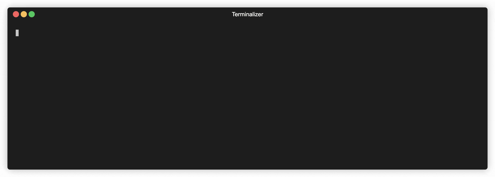

# fish-npm-scripts-autocomplete

[Fish shell](https://fishshell.com) function that parses `package.json` to get user defined scripts and pipes them though [fzf](https://github.com/junegunn/fzf).

It also detects whether you use `yarn` or `npm`.



## Getting Started

### Prerequisites

This function heavily depends on two beautiful tools: `jq` and `fzf`. Please install them if you don't have it yet.

- [jq](https://github.com/stedolan/jq/wiki/Installation)
- [fzf](https://github.com/junegunn/fzf)

### Installation

1. Download script to fish functions directory:

```shell
curl --output-dir "$HOME/.config/fish/functions" -O https://raw.githubusercontent.com/ny1am/fish-npm-scripts-autocomplete/main/npm_scripts_autocomplete.fish
```

2. Optionally add hotkey binding to your fish config:
   `$HOME/.config/fish/functions/fish_user_key_bindings.fish`

```
function fish_user_key_bindings
  ...

  # add the line below to bind a hotkey
  bind \cf npm_scripts_autocomplete # Ctrl+F
end
```

You can use [fish_key_reader](https://fishshell.com/docs/current/cmds/fish_key_reader.html) command to experiment with key bindings :)

## License

MIT License. See `LICENSE` for more information.
